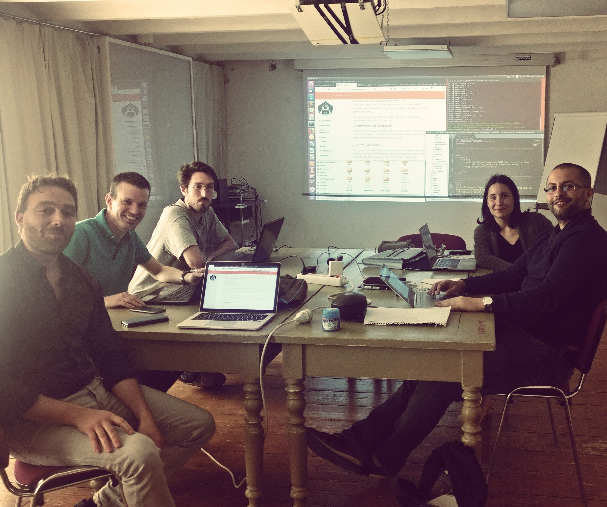

# Event-brite like, Devise Version
Créations d'app Ruby on Rails mises en ligne avec Heroku

-------------

# Introduction : Présentation de l'équipe

## ** WEST COAST MARSEILLE**

##- Audrey (@audreycouture)

##- Jerome (@Jerome)

##- Damien (@damien13005)

##- Maxime (@Maxime)

##- Sam (@sam)

##Fait en pair programming

-------------

# But de l´exercice

Pour ce Mardi 08 Mai 2018 dans le cadre de l'approfoncdissement de Ruby on Rails, nous devions créer une app de gestion  d'évenements avec un systeme de paiment en ligne

1. Reprise du projet Eventbrite (avec utilisation de la Gem Devise)
2. Ajout d'un syteme de paiment (avec utilisation de la Gem Stripe)
------------

# Consignes d'utilisation

## Tests en local:

Pour ouvrir chaque app et la tester il faut downloader le dossier, se placer dedans dans votre terminal et lancer en commande:

> $ bundle install --without production

Pour voir la base données exécuter en commande un

> $ rails db:migrate

Puis tapez la commande suivante pour tester en local l'appli:

> $ rails server

La vous pouver vous balader sur notre code.

Puis ouvrir le fichier sqlite dans le dossier db de l'app, soit avec dbBrowser soit avec SqliteStudio ou autre et visionner.

et Tester la Version en Local host en allant dans ton navigateur sur :

> localhost:3000

## Test en ligne:

Aller sur les liens Heroku suivants

> https://XXXXXXXXXXXXXXXXXXXXXXXX.herokuapp.com

#camarchepas

------------

# Résultats
1. Reprise du projet : Exo  complet !
	Les models => ok
	Les controllers user => ok
	Création d'événement => ok
	Event attendance => ok

2. Ajout de Stripe : Exo complet ! 
	Price => ok
	Le paiement => ok

Merci pour la correction ! 
